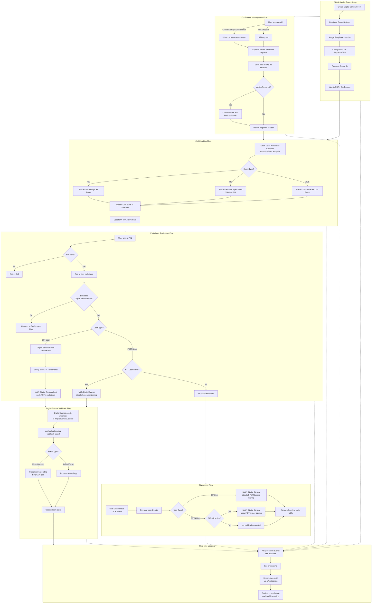

# Digital Samba <> Sinch Conference Middleware Architecture

This document describes the architecture and flow of the Sinch Conference Middleware application, which integrates Sinch Voice API with Digital Samba video conferencing.

# Digital Samba & PSTN Integration Application

## Application Flow Diagram

