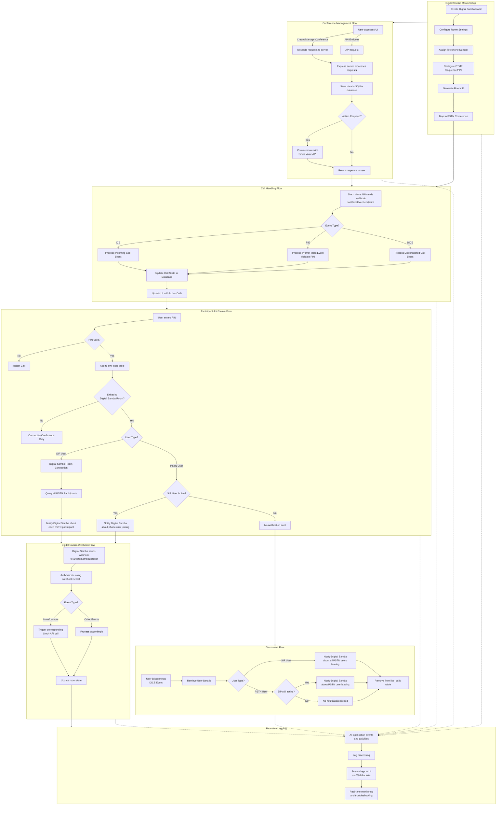

# Digital Samba Room <> Sinch Voice API Middleware Application Architecture

This document describes the architecture and flow of this application which integrates Sinch Voice API with Digital Samba video conferencing.

Workflow Description
1. Digital Samba Room Setup

Purpose: Establishes the foundation for integrating web-based Digital Samba rooms with telephone-based PSTN conferences.
Process:

A Digital Samba room is created as the visual/web interface for participants
Room settings are configured according to requirements
A telephone number is assigned to the room for PSTN users to dial in
A DTMF sequence/PIN is configured, which users must enter to access the conference
A unique Room ID is generated for identification within the system
The Digital Samba room is mapped to a PSTN conference via SIP, enabling integration between web and phone users

2. Conference Management Flow

Purpose: Provides interfaces for administrators to create and manage conferences and their users.
Process:

Administrators can access the system through either the UI or API endpoints
The UI or API sends requests to the Express server for processing
The server processes these requests and stores configuration data in SQLite
If needed, the application communicates with the Sinch Voice API to establish or modify conference settings
The server returns responses to the administrator

Note: This management layer works with the Digital Samba rooms that have already been created

3. Call Handling Flow

Purpose: Processes incoming call events from the Sinch Voice API and maintains call state.
Process:

Sinch Voice API sends webhooks to the /VoiceEvent endpoint when call events occur
The application processes these events based on their type:

ICE (Incoming Call Event): Handles new calls entering the system
PIE (Prompt Input Event): Processes PIN input and validates against configured PINs
DICE (Disconnected Call Event): Manages call termination and cleanup

Call state information is stored in the application database
The UI is updated with active call information for monitoring purposes

4. Participant Join/Leave Flow

Purpose: Manages the integration between phone users and web users by tracking participants.
Process:

When users dial in, they enter their PIN to access the conference
The system validates the PIN against configured values
Valid users are added to the live_calls table in the database
The system determines if the call is linked to a Digital Samba room
The system differentiates between user types:

SIP User: Represents the Digital Samba room connection
PSTN User: Regular phone participants

When a SIP User joins:

The system queries for all existing PSTN participants already in the conference
For each PSTN participant, the system notifies Digital Samba that a phone user has joined
This ensures the web interface displays all current phone participants

When a PSTN User joins:

The system checks if a SIP user (Digital Samba room) is active
If active, Digital Samba is notified about the new phone user
If no SIP user is active, no notification is sent (as there's no web session to update)

5. Disconnect Flow

Purpose: Handles users leaving conferences and ensures proper cleanup and notifications.
Process:

When a user disconnects, a DICE event is triggered
The system retrieves user details from the database before removing the record
The system handles the disconnect based on user type:

If a SIP user leaves: The system notifies Digital Samba about all PSTN users leaving (as web room audio is no longer connected)
If a PSTN user leaves: The system checks if a SIP user is still active

If a SIP user is active, Digital Samba is notified about the phone user leaving
If no SIP user is active, no notification is needed

Finally, the call record is removed from the live_calls table

6. Digital Samba Webhook Flow

Purpose: Processes events from Digital Samba to keep the phone conference synchronized with web conference.
Process:

Digital Samba sends webhook events to the /DigitalSambaListener endpoint
The server authenticates these requests using the configured webhook secret
The system processes different event types:

Mute/Unmute events: Trigger corresponding Sinch API calls to mute/unmute phone participants
Other events: Processed according to specific requirements

The room state is updated in the database to maintain consistency

7. Real-time Logging

Purpose: Provides comprehensive visibility into system operations for monitoring and troubleshooting.
Process:

All application events and activities across all components are captured
Logs are processed and formatted for readability and analysis
These logs are streamed to the UI in real-time via WebSockets
Administrators can monitor system activity and troubleshoot issues as they occur

Note: This logging system covers all components of the application, providing end-to-end visibility

Integration Overview
The application creates a seamless bridge between Digital Samba web conferences and traditional phone conferences by:

Establishing Digital Samba rooms as the foundation
Providing management interfaces for configuration
Processing call events from the Sinch Voice API
Tracking and synchronizing participants across platforms
Handling disconnections appropriately
Processing Digital Samba events
Providing comprehensive real-time logging

This integrated approach allows participants to join from either web or phone interfaces while maintaining synchronized participant lists, audio states, and conference controls.
